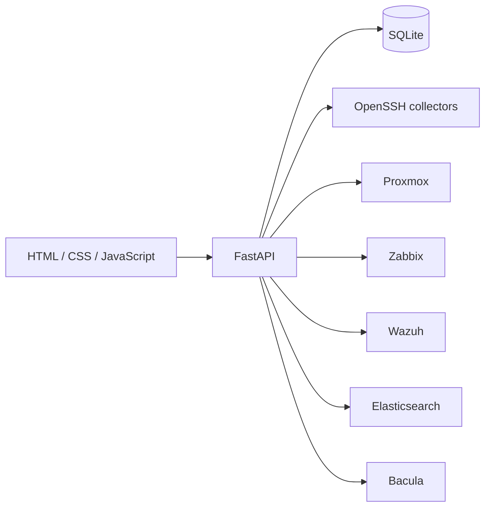
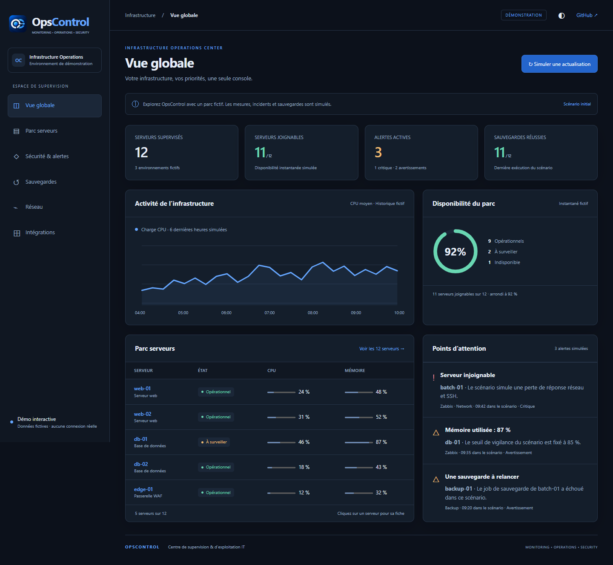
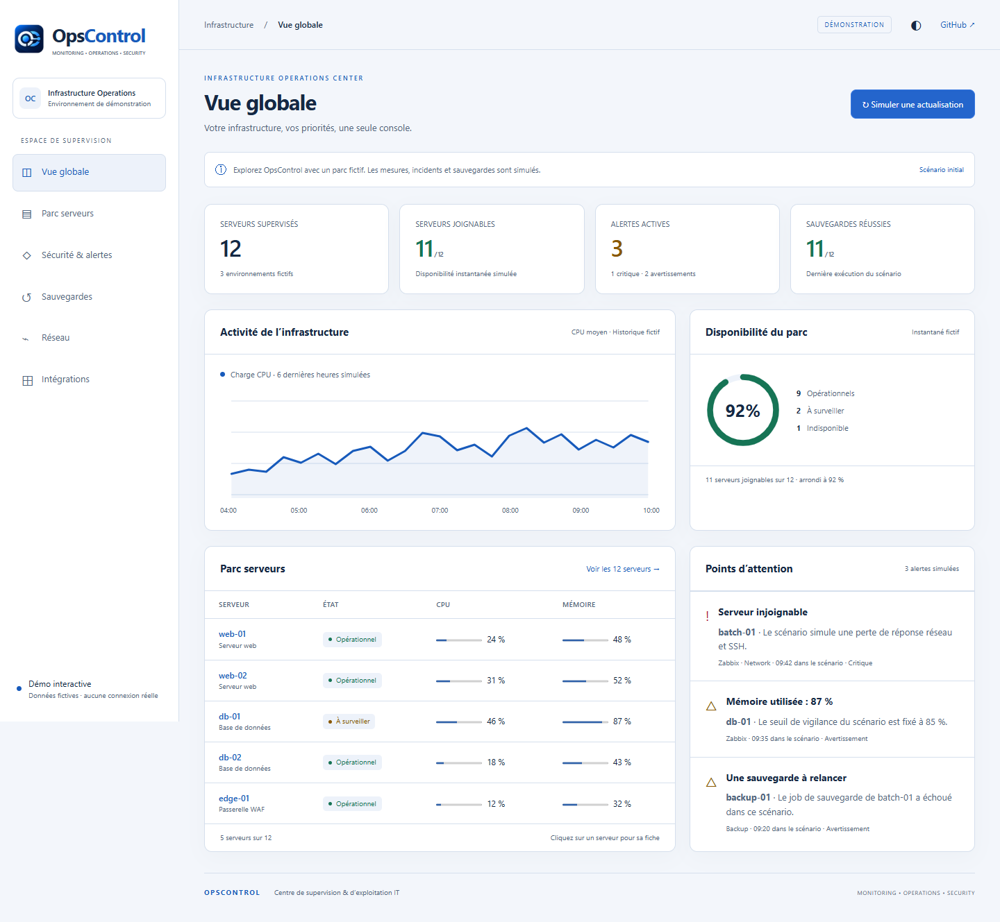
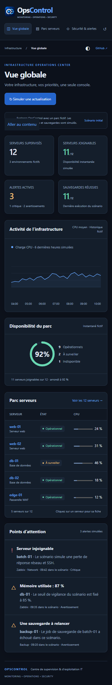

<p align="center">
  
</p>

# OpsControl

**Infrastructure Operations Center**

Centralized infrastructure monitoring and IT operations dashboard for servers,
networks, security, backups, audits and monitoring sources.

[Live demo](https://a0707.github.io/opscontrol/) · [Architecture](docs/architecture.md) · [Security](SECURITY.md)

## Overview

OpsControl brings operational evidence from several infrastructure systems into
one interface. It tracks availability, services, alerts, storage, backups,
security signals and audit history while keeping unknown and stale measurements
visible.

The project was designed for day-to-day infrastructure operations. Remote SSH
collectors are read-oriented, API credentials remain outside the repository and
the application stores normalized observations in a local SQLite database.

## Features

- Central server inventory with roles, environments and criticality.
- Availability and service health with explicit evidence timestamps.
- SSH-based system, storage, share and service audits.
- Consolidated alert center with acknowledgement history.
- Backup job monitoring and operational daily view.
- WAF, TLS certificate and Fail2ban observations.
- Responsive dashboard with dark and light themes.
- Static portfolio demo with fictional data and no external requests.

## Architecture



The backend is a modular FastAPI application. Collector modules normalize remote
observations, SQLite retains current state and history, and the frontend consumes
JSON endpoints without a JavaScript framework. See the
[architecture notes](docs/architecture.md) for more detail.

## Dashboard

The dashboard highlights availability, active alerts, recent backup results and
systems requiring attention. Each server opens a detailed view with measurement
age, services, audit evidence and integration data.



## Monitoring

OpsControl distinguishes three important states:

- a successful and recent measurement;
- stale evidence that must be refreshed;
- unavailable or unknown evidence that must not be presented as healthy.

Collection is bounded by timeouts and concurrency limits. Automatic refresh is
disabled by default in the public configuration.

## Alerting

The alert center combines availability, service, storage, backup, WAF and source
alerts. It preserves the original source severity while applying a common
operational policy and supports local acknowledgement tracking.

## Infrastructure

The included collectors and views cover Linux servers, virtual machines,
containers, network reachability, storage, NFS/SMB shares, scheduled workloads
and backup jobs. Inventory is stored in YAML and can be managed through the API.

## Security & Audit

- SSH host-key verification stays enabled.
- Credentials are read from environment variables and are never stored in the
  inventory.
- Windows installations can load locally encrypted DPAPI values.
- TLS verification remains enabled for infrastructure APIs.
- Audit records are local and should be protected as operational data.
- The application should be placed behind an authenticated HTTPS reverse proxy.

OpsControl is an operations console. It does not replace an IAM system, SIEM,
backup restoration test or vulnerability scanner.

## Integrations

| Integration | Data represented |
|---|---|
| Zabbix | Hosts, triggers, live availability and batch monitoring |
| Proxmox | Cluster, nodes, QEMU virtual machines and LXC containers |
| Wazuh | Manager status and agent inventory |
| Elasticsearch | Cluster health, nodes and shards |
| Bacula | Clients and backup job results |
| OpenSSH | Operating system, services, storage and audit evidence |
| ModSecurity / Fail2ban | WAF configuration and security observations |

## Screenshots

| Dark desktop | Light desktop | Mobile |
|---|---|---|
|  |  |  |

Every screenshot in this repository comes from the fictional demo dataset.

## Installation

Requirements:

- Python 3.11 or newer;
- native OpenSSH client for SSH collection;
- access to the infrastructure APIs you choose to configure.

```bash
python -m venv .venv

# Linux/macOS
source .venv/bin/activate

# Windows PowerShell
# .\.venv\Scripts\Activate.ps1

python -m pip install -r requirements.txt
cp hosts.example.yaml hosts.yaml
python -m uvicorn app:app --host 127.0.0.1 --port 8000
```

Open `http://127.0.0.1:8000`. Keep the service bound to localhost until an
authenticated HTTPS reverse proxy is configured.

## Configuration

`hosts.example.yaml` contains a fictional inventory based on the documentation
address ranges defined by RFC 5737. Copy it to the ignored `hosts.yaml` file and
replace the examples locally.

API connection records contain only endpoint metadata and the **name** of an
environment variable. Put credential values in the process environment or your
secret manager. `.env.example` documents the supported public variables; `.env`
files are ignored.

Example connection metadata is available in
[`examples/api-connections.example.json`](examples/api-connections.example.json).

## Demo mode

The live portfolio demo is a standalone static application under `docs/`. It has
six navigable views, server search and filtering, detail dialogs, light and dark
themes, and a local refresh simulation.

All demo servers, alerts, addresses and metrics are fictional. The demo has a
restrictive Content Security Policy and makes no API or analytics request.

Run it locally without installing the backend:

```bash
python -m http.server 8080 --bind 127.0.0.1 --directory docs
```

Then open `http://127.0.0.1:8080`.

## Security considerations

- Never commit `hosts.yaml`, databases, logs, credentials, SSH material,
  certificates or production screenshots.
- Use accounts and API tokens limited to the required read permissions.
- Verify SSH fingerprints through a trusted channel before registration.
- Protect the SQLite database and audit logs as infrastructure data.
- Review commands produced by diagnostic views before running them manually.
- Run the secret scan and test suite before every public release.

See [SECURITY.md](SECURITY.md) for vulnerability reporting guidance.

## Roadmap

- Complete the migration of the interface to ES modules.
- Add pluggable notification destinations for critical incidents.
- Add documented restore-test evidence to backup monitoring.
- Package repeatable Linux deployment and upgrade procedures.
- Expand automated accessibility and end-to-end coverage.

## Author

**Achraf Belasri**<br>
Infrastructure & Systems Administrator
