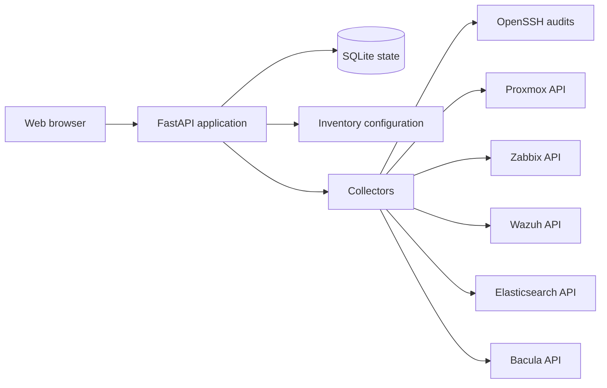

# Architecture

OpsControl separates collection, normalization, persistence and presentation.

The FastAPI application owns the local state and exposes JSON endpoints to a
framework-free JavaScript interface. Collectors use bounded timeouts and preserve
the distinction between an unknown state, stale evidence and a measured failure.
Remote SSH operations are designed for observation. Host-key verification remains
enabled.

The standalone demo in this directory has no backend and makes no external
requests. It exists for portfolio review and GitHub Pages.
